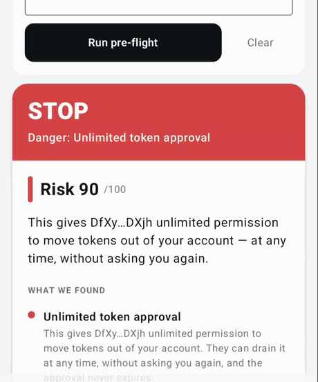

# CLOCK IN Pre-Flight

**The guardian that stands between you and the "Confirm" button.**

Android app for Solana Mobile. Pre-Flight decodes a Solana transaction *before* you sign it and tells
you, in plain language, what it actually does — how much leaves your wallet, to whom, whether it
grants an unlimited delegate, reassigns an authority, or closes an account. Then it checks the assets
involved against live mint/freeze-authority and Token-2022 extension risk.

Built for the **CLOCK IN** Solana Mobile Hackathon (Solana Mobile × Radiants).

## At a glance

| | |
|---|---|
| **Signed APK** | [docs/download/pre-flight-1.0.0.apk](docs/download/pre-flight-1.0.0.apk) — 11.5 MB, verified by `apksigner`, installs and runs on a clean device |
| **Demo video** | [1:48, narrated](https://www.youtube.com/watch?v=ycDWdsFawLg) — a drainer stopped, a real mainnet swap decoded, a real MWA signature |
| **Pitch deck** | [docs/pitch-deck.pdf](docs/pitch-deck.pdf) — 11 slides |
| **Tests** | `216` across `16` classes, `0` failures (3 opt-in live tests skipped offline) |
| **Verified end to end** | [`scripts/verify.sh`](./scripts/verify.sh) — 12 checks, all passing; `--live` exercises real mainnet |
| **Core engine** | [`app/src/main/java/com/clockin/preflight/engine/`](app/src/main/java/com/clockin/preflight/engine) — 14 files, **zero `android.*` imports**, runs on the JVM |

Two verdicts produced by the shipped build:

- A synthetic drainer approval → **STOP · "Unlimited token approval" · Risk 90**, with `u64::MAX`
  shown as raw evidence
- A **real mainnet** pump.fun swap, fetched by signature → **CAUTION · "Token account closed" · Risk 24**

Wallet-agnostic by construction: the risk engine is pure Kotlin, and the wallet path is Mobile Wallet
Adapter, so no vendor SDK sits in the decision.

## Demo video

[](https://www.youtube.com/watch?v=ycDWdsFawLg)

**[▶ Watch the full demo (1:48) on YouTube](https://www.youtube.com/watch?v=ycDWdsFawLg)** — a real
drainer case, a real mainnet swap decoded on-device, and a real Mobile Wallet Adapter signature.

**[Pitch deck (PDF, 11 slides)](docs/pitch-deck.pdf)** · **[Signed release APK](docs/download/pre-flight-1.0.0.apk)** (11.5 MB)

---

## The problem

People do not usually lose money on Solana by picking the wrong token. They lose it by **signing the
wrong transaction** — a drainer disguised as a claim page, an unlimited `Approve`, an authority
reassignment, a Token-2022 transfer hook that moves funds again after the fact.

Wallet vendors have started showing warnings, but those warnings are:

- **owned by one wallet** — they only protect you inside that wallet's app;
- **desktop-first** — the mobile experience is where the signatures actually happen;
- **opaque** — they say "this looks risky" without explaining the mechanics.

The result: the single highest-stakes moment in a user's day — the three seconds before they tap
Confirm — is the least explained.

## What Pre-Flight does

| Surface | What it shows |
|---|---|
| **Pre-Flight** | A verdict card for any transaction: fetch by signature, paste raw base64, or intercept a Mobile Wallet Adapter sign request. Full-balance transfers, unlimited approvals, authority changes, account closes, dangerous Token-2022 extensions, unknown programs, and lure text in memos. |
| **Authority Check** | Scans *your own* holdings for live mint authority, live freeze authority, mutable metadata, and unlocked liquidity — the risk that keeps applying while the token sits in your wallet. |
| **Address Guard** | Flags lookalike (address-poisoning) and first-time recipients by comparing against your own history. |

Every verdict is computed **on-device** by a pure-Kotlin engine, so it works with any wallet, and the
reasoning is auditable rather than a black box.

## Architecture

```
app/src/main/java/com/clockin/
  engine/   pure-Kotlin Solana wire-format decoder + deterministic risk rules   (no android.*)
  data/     Solana JSON-RPC client + RugCheck/GoPlus token-risk merge
  ui/       Compose presentation layer
```

The engine has **zero Android dependencies** and runs under plain JVM unit tests — the verdict logic
is deterministic, testable, and reviewable.

### Live signal sources

| Source | Use |
|---|---|
| Solana JSON-RPC (`solana-rpc.publicnode.com`) | transactions, balances, signatures, account info |
| [RugCheck](https://rugcheck.xyz) `api.rugcheck.xyz/v1/tokens/{mint}/report` | score, insider networks, lockers, authorities |
| [GoPlus](https://docs.gopluslabs.io/reference/solanatokensecurityusingget.md) Solana token security | the raw flag set (mintable, freezable, transfer hook, default-frozen, …) |

## Build

Everything needed to compile is either committed or fetched by one script — no Android Studio, no
system SDK, no manual setup.

```bash
./scripts/bootstrap_toolchain.sh         # one time: JDK 17 + SDK 35 + Gradle (~950 MB)
./build.sh :app:assembleDebug            # debug APK
./build.sh :app:assembleRelease          # signed release APK
./build.sh :app:testDebugUnitTest        # the full test suite
```

`./scripts/bootstrap_toolchain.sh --check` verifies an existing toolchain without downloading.

**Check every claim in this README yourself:**

```bash
./scripts/verify.sh            # toolchain, build, tests, deliverables, APK signature, MWA wiring
./scripts/verify.sh --live     # …plus the real Solana RPC and both risk APIs
```

It prints a PASS/FAIL line per claim and exits non-zero if any of them stops being true.

**Verified from a clean clone with a cold Gradle cache:** `assembleDebug` succeeded in 6m05s and the
suite ran **216 tests, 0 failures** — so the published tree really is self-contained.

Two environment notes that shaped the setup, both measured rather than assumed:

- The Android SDK zips do not extract to the paths the SDK expects. `build-tools_r35_macosx.zip`
  contains `android-15/` even though its `source.properties` says `Pkg.Revision=35.0.0`, and
  `platform-35_r02.zip` contains `android-35/`. The bootstrap script stages and renames them.
- `dl.google.com` throttles to ~60 B/s on some networks while Tencent's SDK mirror holds ~4.4 MB/s,
  and Maven Central was unreachable while the mirror proxies in `settings.gradle.kts` worked. The
  build is pinned to those mirrors deliberately.

Requirements if you prefer your own toolchain: JDK 17, Android SDK platform 35 + build-tools 35.
`compileSdk` is pinned to 35 and the Mobile Wallet Adapter client to `2.0.3`, because MWA 2.2.x
requires compileSdk 36.


## Status

Verified end-to-end on 2026-10-05/06 (Asia/Shanghai). Every checked item below has a command or a
screenshot behind it.

- [x] Android build chain reproducible from a bare machine (JDK 17 + SDK 35 + Gradle, via regional mirrors)
- [x] Compose UI: Pre-Flight / Authority / Address surfaces
- [x] **Pre-Flight runs on real mainnet data**: paste a signature → fetch the transaction → decode
      on-device → verdict card. Verified on an emulator against a live pump.fun swap
- [x] Token-risk lookup against live RugCheck + GoPlus (`Authority` tab)
- [x] **Mobile Wallet Adapter sign request completes with a real Ed25519 signature** — verified
      end-to-end (`scripts/mwa_proof.sh`, exit 0): real ECDH+AES-GCM session, real JSON-RPC,
      215-byte legacy transaction signed and the signature verified
- [x] **Mobile Wallet Adapter sign request completes inside the app** — verified on both the debug and
      the signed release APK: `authorize=OK` → `sign_transactions=OK` → Ed25519 verified on-device
      (BouncyCastle). Evidence: `tools/shots/app-wallet-release-04-signature.png`,
      `tools/MWA-RUNTIME-REPORT.md`
- [x] Risk engine: pure-Kotlin decoder (legacy + v0), SPL Token/Token-2022/System/ATA/ComputeBudget/Memo,
      deterministic rules, typed errors on malformed input — **216 tests, 0 failures**
- [x] Signed release APK: `app/build/outputs/apk/release/app-release.apk` (11.5 MB, `apksigner` verified)
- [ ] Demo video
- [ ] Submitted on the CLOCK IN platform

Evidence: `docs/media/shots/` (device captures), `tools/MWA-RUNTIME-REPORT.md` (the Mobile Wallet
Adapter runtime proof, including the four integration gotchas).

## Honest limitations

- **Holdings enumeration is not available on free RPC.** `getTokenAccountsByOwner`,
  `getProgramAccounts` and `getTokenSupply` are all blocked on the reachable public endpoint
  (`403 Indexed requests require a personal token`). So `Authority Check` takes a mint address rather
  than scanning a whole wallet automatically. The engine already accepts a populated balance context,
  so wiring a keyed RPC endpoint is a small change, not a redesign.
- **The risk verdict is context-free by default.** With no wallet context the engine cannot always
  know whether a transfer is "all of it"; supplying balances makes the narrative sharper.
- The demo counterparty on an emulator is a `walletlib` test wallet. The client path is byte-for-byte
  the same one that talks to Phantom on a real Seeker.


- **The drainer demo case is synthetic, and labelled as such.** Real mainnet traffic essentially never
  contains an unlimited `Approve` (the engine author scanned ~3,000 transactions without finding one),
  so `tools/demo/build-drainer.mjs` builds a wire-format-faithful transaction with `u64::MAX` approve
  plus a lure memo. Everything else in the demo is live mainnet data.

## Team

Independent solo builder. No VC or angel funding.

## License

MIT — see [LICENSE](LICENSE).
